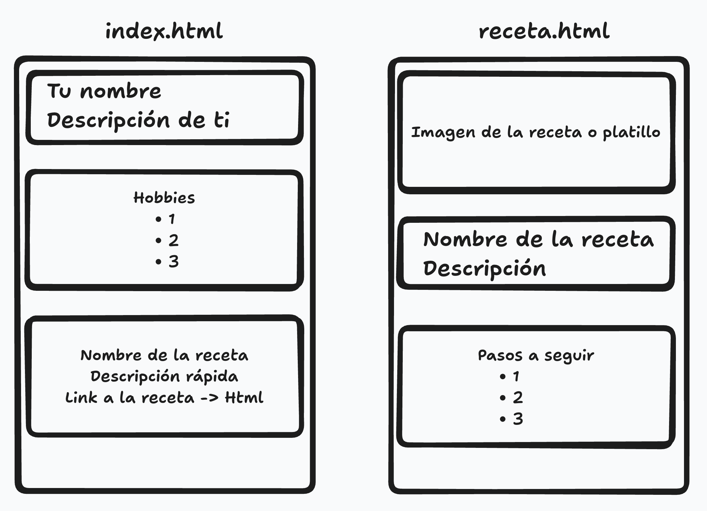

## HW 4

1. Crear un repositorio en github que se llame `web-page-2`.

2. Crear dos archivos HTML con la siguiente estructura:
   

3. Utilizar las siguientes etiquetas:

   - header
   - section
   - main
   - h1-h6
   - p
   - a
   - ul
   - ol
   - li

4. No se preocupen por el diseño, lo que importa es el contenido
